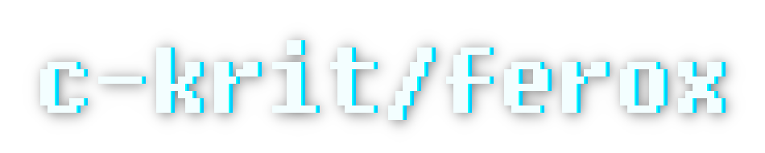

<div align="center">

<br>

[](https://github.com/c-krit/ferox/releases)
[](https://www.codefactor.io/repository/github/c-krit/ferox)
[](https://github.com/c-krit/ferox)
[](https://github.com/c-krit/ferox/blob/main/LICENSE)

A lightweight 2D physics engine written in C, for educational purposes.

[Documentation](/wiki) &mdash;
[Examples](./examples/src) &mdash;
[Prerequisites](#prerequisites)

</div>

## Features

<div align="center">
  <video src="https://github.com/user-attachments/assets/b8a8da2e-283b-4208-820b-914429b51e08" />
</div>

> *NOTE: This project was made for educational purposes (mainly for me to learn how a physics engine works), and therefore it is not recommended to use this library in production. Consider using other 2D physics engines with better performance such as [Box2D](https://github.com/erincatto/box2d) and [Chipmunk2D](https://github.com/slembcke/Chipmunk2D).*

- Broad-phase collision detection with spatial hashing algorithm
- Narrow-phase collision detection with SAT (Separating Axis Theorem)
- Numerical integration with semi-implicit Euler method
- Projected Gauss-Seidel iterative constraint solver
- Persistent contacts (contact cache) with warm starting
- Point-in-Convex-Hull, proximity and raycast queries
- Support for basic collision event callbacks
- WebAssembly examples powered by [raylib](https://github.com/raysan5/raylib)

## Prerequisites

- GCC version 6.4.0+
- Git version 2.14.0+
- GNU Make version 4.1+ (or BSD Make 20181221+)

### Optional

Make sure you have installed [raylib 4.5.0+](https://github.com/raysan5/raylib/releases/tag/4.5.0) to build all examples.

## Building

<details>
<summary>Compiling for Windows</summary>

### [MSYS2 (MinGW-w64)](https://www.msys2.org/)

Download the latest release of MSYS2 from [here](https://www.msys2.org/) and follow the instructions on the homepage.

```console
# MSYS2, UCRT 64-bit

$ pacman -Syu && pacman -S mingw-w64-ucrt-x86_64-gcc
$ git clone https://github.com/c-krit/ferox && cd ferox
$ make
```

Then you can install raylib by downloading the `mingw-w64-x86_64-raylib` package:

```console
$ pacman -S mingw-w64-x86_64-raylib
$ cd examples
```

You will also need to configure the `RAYLIB_INCLUDE_PATH` and `RAYLIB_LIBRARY_PATH` variables in `Makefile.mingw`:

```
$ vim Makefile.mingw
```

```
# TODO: Edit these values to match your raylib installation path!
RAYLIB_INCLUDE_PATH ?= /mingw64/include 
RAYLIB_LIBRARY_PATH ?= /mingw64/lib
```

Finally, in order to compile the examples, do:

```
$ make -f Makefile.mingw
```

<br />

### Visual Studio 2022

Download the latest release of this library from [here](https://github.com/c-krit/ferox/releases) and extract the `.zip` file to your working directory. Then, start [Windows PowerShell](https://learn.microsoft.com/en-us/powershell/scripting/windows-powershell/starting-windows-powershell?view=powershell-7.3) and type the following command to start the [Developer PowerShell](https://learn.microsoft.com/en-us/visualstudio/ide/reference/command-prompt-powershell?view=vs-2022):

```console
PS C:\Users\jdeokkim> & 'C:\Program Files\Microsoft Visual Studio\2022\Community\Common7\Tools\Launch-VsDevShell.ps1' -Arch amd64

**********************************************************************
** Visual Studio 2022 Developer PowerShell v17.7.4
** Copyright (c) 2022 Microsoft Corporation
**********************************************************************

PS C:\Users\jdeokkim\source\repos> ls ferox


    디렉터리: C:\Users\jdeokkim\source\repos\ferox


Mode                 LastWriteTime         Length Name
----                 -------------         ------ ----
d-----      2023-09-13   오후 9:15                .github
d-----      2023-09-13   오후 9:15                docs
d-----      2023-09-13   오후 9:15                examples
d-----      2023-09-13   오후 9:15                include
d-----      2023-09-13   오후 9:15                src
-a----      2023-09-13   오후 9:15           2599 .clang-format
-a----      2023-09-13   오후 9:15           1323 .gitignore
-a----      2023-09-13   오후 9:15            629 CREDITS.md
-a----      2023-09-13   오후 9:15           1099 LICENSE
-a----      2023-09-13   오후 9:15           2388 Makefile
-a----      2023-09-13   오후 9:15           1497 Makefile.emcc
-a----      2023-09-13   오후 9:15           1499 Makefile.mingw
-a----      2023-09-13   오후 9:15           2442 NMakefile
-a----      2023-09-13   오후 9:15          12944 README.md
```

In order to build this library, do:

```console
PS C:\Users\jdeokkim\source\repos> cd ferox
PS C:\Users\jdeokkim\source\repos\ferox> nmake -f NMakefile
```

<br />

### [w64devkit](https://github.com/skeeto/w64devkit)

Download the latest release of w64devkit from [here](https://github.com/skeeto/w64devkit/releases), run `w64devkit-x64-2.0.0.exe` and wait for the archive to be extracted to your working directory, and run `w64devkit/w64devkit.exe`.

```console
$ mkdir ~/workspace && cd ~/workspace
$ wget https://github.com/c-krit/ferox/archive/refs/heads/main.zip && unzip main.zip
$ mv ferox-main ferox && cd ferox
```

In order to build this library, do:

```console
$ make -f Makefile.mingw
```

You may need to compile raylib for Windows before compiling the examples:

```console
$ cd .. && wget https://github.com/raysan5/raylib/archive/refs/tags/4.5.0.zip
$ unzip 4.5.0.zip && mv raylib-4.5.0 raylib
$ make -C raylib/src -j`nproc`
$ rm ./*.zip
```

Finally, in order to compile the examples, do:

```console
$ cd ~/workspace/ferox/examples
$ make -f Makefile.mingw \
  RAYLIB_INCLUDE_PATH=../../raylib/src RAYLIB_LIBRARY_PATH=../../raylib/src
```

</details>

<details>
<summary>Compiling for GNU/Linux</summary>

### Arch Linux / Manjaro Linux

```console
$ sudo pacman -Syu && sudo pacman -S base-devel git
$ git clone https://github.com/c-krit/ferox ~/ferox && cd ~/ferox
$ make
```

In order to compile the examples, do:

```console
$ sudo pacman -Syu && sudo pacman -S alsa-lib mesa libx11 libxrandr \
  libxi libxcursor libxinerama
$ git clone https://github.com/raysan5/raylib ~/raylib && cd ~/raylib/src
$ make PLATFORM=PLATFORM_DESKTOP GLFW_LINUX_ENABLE_WAYLAND=OFF && make install
```

```console
$ cd ~/ferox/examples && make
```

### Debian / Ubuntu

```console
$ sudo apt install build-essential git
$ git clone https://github.com/c-krit/ferox ~/ferox && cd ~/ferox
$ make
```

In order to compile the examples, do:

```console
$ sudo apt update && sudo apt install libasound2-dev libgl1-mesa-dev \
  libglu1-mesa-dev libx11-dev libxrandr-dev libxi-dev libxcursor-dev \
  libxinerama-dev libxkbcommon-dev
$ git clone https://github.com/raysan5/raylib ~/raylib && cd ~/raylib/src
$ make PLATFORM=PLATFORM_DESKTOP GLFW_LINUX_ENABLE_WAYLAND=OFF && make install
```

```console
$ cd ~/ferox/examples && make
```

### Void Linux

```console
$ sudo xbps-install base-devel git
$ git clone https://github.com/c-krit/ferox ~/ferox && cd ~/ferox
$ make
```

In order to compile the examples, do:

```console
$ sudo xbps-install -Syu && sudo xbps-install alsa-lib-devel libglvnd-devel \
  libX11-devel libXrandr-devel libXi-devel libXcursor-devel libXinerama-devel mesa
$ git clone https://github.com/raysan5/raylib ~/raylib && cd ~/raylib/src
$ make PLATFORM=PLATFORM_DESKTOP GLFW_LINUX_ENABLE_WAYLAND=OFF && make install
```

```console
$ cd ~/ferox/examples && make
```

</details>

<details>
<summary>Compiling for *BSD (FreeBSD)</summary>

### FreeBSD

```console
$ sudo pkg install git
$ git clone https://github.com/c-krit/ferox && cd ferox
$ make
```

Then you can install raylib by downloading the `raylib` package:

```
$ sudo pkg install raylib
```

Finally, in order to compile the examples, do:

```console
$ cd examples
$ make RAYLIB_INCLUDE_PATH=/usr/local/include RAYLIB_LIBRARY_PATH=/usr/local/lib
```

</details>

<details>
<summary>Compiling for Raspberry Pi</summary>

### Raspberry Pi OS (Raspbian)

```console
$ sudo apt install build-essential git
$ git clone https://github.com/c-krit/ferox && cd ferox
$ make
```

You may need to recompile raylib for Raspberry Pi before compiling the examples:

```console
$ sudo apt install libdrm-dev libegl1-mesa-dev libgles2-mesa-dev libgbm-dev
$ git clone https://github.com/raysan5/raylib && cd raylib/src
$ make -j`nproc` PLATFORM=PLATFORM_DRM
```

Finally, in order to compile the examples, do:

```console
$ cd examples
$ make -f Makefile.drm
```

</details>

<details>
<summary>Compiling for the Web (LLVM-to-WebAssembly)</summary>

<br />

Compiling for the Web requires installation of the [Emscripten SDK](https://emscripten.org/).

### Debian / Ubuntu

```console
$ sudo apt install build-essential git
$ git clone https://github.com/emscripten-core/emsdk && cd emsdk
$ ./emsdk install latest
$ ./emsdk activate latest
$ source ./emsdk_env.sh
```

After setting up the environment variables for Emscripten SDK, do:

```console
$ git clone https://github.com/c-krit/ferox && cd ferox
$ make -f Makefile.emcc
```

You may need to recompile raylib for the Web before compiling the examples:

```console
$ git clone https://github.com/raysan5/raylib && cd raylib/src
$ make -j`nproc` PLATFORM=PLATFORM_WEB -B
```

Finally, in order to compile the examples, do:

```console
$ cd examples
$ make -f Makefile.emcc RAYLIB_PATH=../../raylib
$ emrun --no_browser ./bin/basic.html
```

</details>

<details>
<summary>Cross-compiling from GNU/Linux to Windows (WSL2)</summary>

### Debian / Ubuntu

```console
$ sudo apt install build-essential git mingw-w64
$ git clone https://github.com/c-krit/ferox && cd ferox
$ make -f Makefile.mingw
```

You may need to recompile raylib for Windows before compiling the examples:

```console
$ git clone https://github.com/raysan5/raylib && cd raylib/src
$ make -j`nproc` CC=x86_64-w64-mingw32-gcc AR=x86_64-w64-mingw32-ar OS=Windows_NT
```

Lastly, in order to compile the examples, do:

```console
$ cd examples
$ make -f Makefile.mingw RAYLIB_INCLUDE_PATH=../../raylib RAYLIB_LIBRARY_PATH=../../raylib
```

</details>

## References

### Introduction

- [Catto, Erin. “How Do Physics Engines Work?” USC GamePipe Laboratory. January, 2019.](https://github.com/erincatto/box2d-lite/blob/master/docs/HowDoPhysicsEnginesWork.pdf)
- [Gaul, Randy. “How to Create a Custom Physics Engine.” Envato Tuts+. April–June, 2013.](https://gamedevelopment.tutsplus.com/series/how-to-create-a-custom-physics-engine--gamedev-12715)
- [Hecker, Chris. “Behind the Screen: Physics, Parts 1-3.” Game Developer Magazine. 1996–1997.](https://www.chrishecker.com/Rigid_Body_Dynamics)

### Collision Detection

- [Bittle, William. “Contact Points Using Clipping.” dyn4j.org. November 17, 2011.](https://dyn4j.org/2011/11/contact-points-using-clipping/)
- [Bittle, William. “SAT (Separating Axis Theorem).” dyn4j.org. January 01, 2010.](https://dyn4j.org/2010/01/sat/)
- [Bostock, Mike. “Sutherland–Hodgman Clipping.” observablehq.com. August 02, 2020.](https://observablehq.com/@mbostock/sutherland-hodgman-clipping)
- [Boyd, Stephen P. “Convex Optimization.”, 46–51. Cambridge University Press. March, 2004.](https://web.stanford.edu/~boyd/cvxbook/bv_cvxbook.pdf)
- [Coumans, Erwin. “Collision Detection – Contact Generation and GPU Acceleration.” ACM SIGGRAPH ASIA 2010. July 26, 2010.](https://sgvr.kaist.ac.kr/~sungeui/Collision_tutorial/Erwin.pdf)
- [E. J. Hastings, J. Mesit, and R. K. Guha. “Optimization of Large-Scale, Real-Time Simulations by Spatial Hashing. Proc. 2005 Summer Computer Simulation Conference, Cherry Hill, NJ, USA. July 24–28, 2005.](https://scholar.google.com/citations?view_op=view_citation&hl=en&user=u_GkP-EAAAAJ&citation_for_view=u_GkP-EAAAAJ:UeHWp8X0CEIC)
- [MacDonald, Tristam. “Spatial Hashing.” GameDev.net. October 01, 2009.](https://www.gamedev.net/tutorials/programming/general-and-gameplay-programming/spatial-hashing-r2697/)
- [Teschner, Matthias, Bruno Heidelberger, Matthias Müller, Danat Pomeranets, and Markus Gross. n.d. “Optimized Spatial Hashing for Collision Detection of Deformable Objects.” Computer Graphics Laboratory, ETH Zurich. January 2005.](https://matthias-research.github.io/pages/publications/tetraederCollision.pdf)
- [Van den Bergen, Gino. “Physics for Game Programmers: Spatial Data Structures.” Game Developers Conference 2013. March, 2013.](https://storage.googleapis.com/google-code-archive-downloads/v2/code.google.com/box2d/GDC13_vandenBergen_Gino_Physics_Tut.pdf)

### Constraint Solver

- [Catto, Erin. “Fast and Simple Physics Using Sequential Impulses.” San Jose, CA. March, 2006.](https://box2d.org/files/ErinCatto_SequentialImpulses_GDC2006.pdf)
- [Catto, Erin. “Iterative Dynamics with Temporal Coherence.” Crystal Dynamics, Menlo Park, CA. June, 2005.](https://box2d.org/files/ErinCatto_IterativeDynamics_GDC2005.pdf)
- [Catto, Erin. “Solver2D.” box2d.org. February 05, 2024.](https://box2d.org/posts/2024/02/solver2d/)
- [Chou, Ming-Lun. “Game Physics: Resolution – Contact Constraints.” allenchou.net. December 31, 2013.](https://allenchou.net/2013/12/game-physics-resolution-contact-constraints/)
- [Chou, Ming-Lun. “Game Physics: Stability – Warm Starting.” allenchou.net. January 04, 2014.](http://allenchou.net/2014/01/game-physics-stability-warm-starting/)
- [Strunk, Oliver. “Stop my Constraints from Blowing Up!” Game Developers Conference 2013. March, 2013.](https://storage.googleapis.com/google-code-archive-downloads/v2/code.google.com/box2d/Strunk_Oliver_Stop_My_Constraints_From_Blowing_Up.pdf)
- [Tonge, Richard. “Iterative Rigid Body Solvers.” Game Developers Conference 2013. March, 2013.](https://archive.org/details/GDC2013Tonge)

### Numerical Methods

- [Catto, Erin. “Numerical Methods.” San Jose, CA. March, 2015.](https://box2d.org/files/ErinCatto_NumericalMethods_GDC2015.pdf)
- [Fiedler, Glenn. “Integration Basics.” Gaffer on Games. June 01, 2004.](https://gafferongames.com/post/integration_basics/)
- [Witkin, Andrew, and David Baraff. n.d. “An Introduction to Physically Based Modeling: Differential Equation Basics.” ACM SIGGRAPH 1995. August, 1995.](http://www.cs.cmu.edu/~baraff/sigcourse/index.html)

### Raycast Queries

- [Rees, Gareth. “How do you detect where two line segments intersect?” stackoverflow.com. February, 2009.](https://stackoverflow.com/questions/563198/how-do-you-detect-where-two-line-segments-intersect/565282#565282)
- [Scratchapixel. “A Minimal Ray-Tracer: Rendering Simple Shapes (Sphere, Cube, Disk, Plane, etc.).” scratchapixel.com. November, 2022.](https://www.scratchapixel.com/lessons/3d-basic-rendering/minimal-ray-tracer-rendering-simple-shapes/ray-sphere-intersection.html)

### Miscellaneous

- [Allan, Jackson. “An Extensive Benchmark of C and C++ Hash Tables.” jacksonallan.github.io. May 29, 2024.](https://jacksonallan.github.io/c_cpp_hash_tables_benchmark/)
- [Anderson, Sean. “Bit Twiddling Hacks.” graphics.stanford.edu. 1997.](http://graphics.stanford.edu/%7Eseander/bithacks.html)

## License

MIT License

> Copyright (c) 2021-2024 Jaedeok Kim (jdeokkim@protonmail.com)
> 
> Permission is hereby granted, free of charge, to any person obtaining a copy
> of this software and associated documentation files (the "Software"), to deal
> in the Software without restriction, including without limitation the rights
> to use, copy, modify, merge, publish, distribute, sublicense, and/or sell
> copies of the Software, and to permit persons to whom the Software is
> furnished to do so, subject to the following conditions:
> 
> The above copyright notice and this permission notice shall be included in all
> copies or substantial portions of the Software.
> 
> THE SOFTWARE IS PROVIDED "AS IS", WITHOUT WARRANTY OF ANY KIND, EXPRESS OR
> IMPLIED, INCLUDING BUT NOT LIMITED TO THE WARRANTIES OF MERCHANTABILITY,
> FITNESS FOR A PARTICULAR PURPOSE AND NONINFRINGEMENT. IN NO EVENT SHALL THE
> AUTHORS OR COPYRIGHT HOLDERS BE LIABLE FOR ANY CLAIM, DAMAGES OR OTHER
> LIABILITY, WHETHER IN AN ACTION OF CONTRACT, TORT OR OTHERWISE, ARISING FROM,
> OUT OF OR IN CONNECTION WITH THE SOFTWARE OR THE USE OR OTHER DEALINGS IN THE
> SOFTWARE. 
