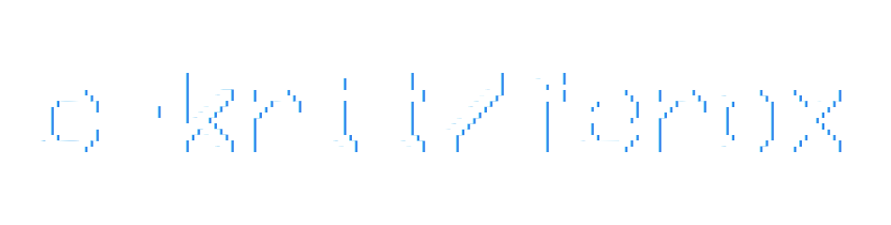

<div align="center">

<br>

[](https://github.com/c-krit/ferox/releases)
[](https://www.codefactor.io/repository/github/c-krit/ferox)
[](https://github.com/c-krit/ferox)
[](https://github.com/c-krit/ferox/blob/main/LICENSE)

A 2D collision detection and physics library written in C.

**WARNING: This library is in an early alpha stage, use it at your own risk.**

[Documentation](https://github.com/c-krit/ferox/wiki) &mdash;
[Examples](https://github.com/c-krit/ferox/tree/main/examples) &mdash;
[Prerequisites](#prerequisites)

</div>

## Features


**Since this project was made to learn how a physics engine works, I am not planning to add a lot of features to it.**

- Broad-phase collision detection with spatial hashing algorithm
- Narrow-phase collision detection with SAT (Separating Axis Theorem)
- 'Sequential Impulse' iterative constraint solver
- Semi-implicit (symplectic) Euler integrator
- Support for collision event callbacks

## Prerequisites

- GCC version 9.4.0+
- GNU Make version 4.1+
- Git version 2.17.1+

```console
$ sudo apt install build-essential git
```

### Optional

Make sure you have installed [raylib 4.0.0+](https://github.com/raysan5/raylib) to compile all examples.

## Building

This project uses [GNU Make](https://www.gnu.org/software/make) as the build system.

```console
$ git clone https://github.com/c-krit/ferox
$ cd ferox
$ make
```

You can also build this library as standalone-mode to avoid `raylib.h` header inclusion and functions that depend on raylib:

```console
$ make BUILD=STANDALONE
```

### Compiling into WebAssembly

Compiling for the Web requires installation of the [Emscripten SDK](https://emscripten.org/docs/introducing_emscripten/about_emscripten.html).

```console
$ git clone https://github.com/emscripten-core/emsdk && cd emsdk
$ ./emsdk install latest
$ ./emsdk activate latest
$ source ./emsdk_env.sh
```

After setting up the environment variables for Emscripten SDK, do:

```console
$ make PLATFORM=WEB
```

### Cross-compiling for Windows

You may need to recompile raylib for Windows before building this library.

```console
$ git clone https://github.com/raysan5/raylib && cd raylib/src
$ make -j`nproc` CC=x86_64-w64-mingw32-gcc AR=x86_64-w64-mingw32-ar OS=Windows_NT
```

Make sure to set the value of `RAYLIB_PATH` variable to cross-compile for Windows:

```console
$ make PLATFORM=WINDOWS RAYLIB_PATH=../raylib
```

## References

- [Apple Inc. (2021), SKPhysicsBody | Apple Developer Documentation](https://developer.apple.com/documentation/spritekit/skphysicsbody)
- [Bostock, Mike. (2018, January 23), Sutherland–Hodgman Clipping](https://observablehq.com/@mbostock/sutherland-hodgman-clipping)
- [dyn4j. (2011, November 11), Contact Points Using Clipping](http://www.dyn4j.org/2011/11/contact-points-using-clipping)
- [dyn4j. (2010, January 01), SAT (Separating Axis Theorem)](http://dyn4j.org/2010/01/sat)
- [Catto, Erin. (2006), Fast and Simple Physics using Sequential Impulses](https://box2d.org/files/ErinCatto_SequentialImpulses_GDC2006.pdf)
- [Catto, Erin. (2019), How Do Physics Engines Work?](https://github.com/erincatto/box2d-lite/blob/master/docs/HowDoPhysicsEnginesWork.pdf)
- [Catto, Erin. (2005), Iterative Dynamics with Temporal Coherence](https://box2d.org/files/ErinCatto_IterativeDynamics_GDC2005.pdf)
- [Chou, Ming-Lun. (2014, January 7), Game Physics: Stability – Warm Starting](http://allenchou.net/2014/01/game-physics-stability-warm-starting/)
- [Coumans, Erwin. (2010, July 26), Collision Detection: Contact Generation and GPU Acceleration](https://sgvr.kaist.ac.kr/~sungeui/Collision_tutorial/Erwin.pdf)
- [Hastings, Erin & Mesit, Jaruwan. (2005). Optimization of large-scale, real-time simulations by spatial hashing](http://www.cs.ucf.edu/~jmesit/publications/scsc%202005.pdf)
- [Fiedler, Glenn. (2013, February 24), Collision Response and Coulomb Friction](https://gafferongames.com/post/collision_response_and_coulomb_friction)
- [Fiedler, Glenn. (2004, June 10), Fix Your Timestep!](https://gafferongames.com/post/fix_your_timestep)
- [Fiedler, Glenn. (2004, June 01), Integration Basics](https://gafferongames.com/post/integration_basics)
- [Gaul, Randy. (2013, April 06), How to Create a Custom Physics Engine](https://gamedevelopment.tutsplus.com/series/how-to-create-a-custom-physics-engine--gamedev-12715)
- [Gaul, Randy. (2013, July 16), Separating Axis Test (SAT) and Support Points in 2D](http://www.randygaul.net/wp-content/uploads/2013/07/SATandSupportPoints.pdf)
- [Gregorius, Dirk. (2013), The Separating Axis Test between Convex Polyhedra](https://storage.googleapis.com/google-code-archive-downloads/v2/code.google.com/box2d/DGregorius_GDC2013.zip)
- [Macdonald, Tristam. (2009, October 01), Spatial Hashing](https://www.gamedev.net/tutorials/programming/general-and-gameplay-programming/spatial-hashing-r2697/)
- [Manzke, Michael. (2016, February 22), Multiple Contact Resolution](https://www.scss.tcd.ie/~manzkem/CS7057/cs7057-1516-10-MultipleContacts-mm.pdf)
- [NVIDIA Corporation. (2017, May 12), NVIDIA PhysX 3.4.0 API Documentation](https://docs.nvidia.com/gameworks/content/gameworkslibrary/physx/guide/Manual/Index.html)
- [Rees, Gareth. (2019, February 09), How do you detect where two line segments intersect?](https://stackoverflow.com/a/565282)
- [Scratchapixel. (n.d.), A Minimal Ray-Tracer: Rendering Simple Shapes (Sphere, Cube, Disk, Plane, etc.)](https://www.scratchapixel.com/lessons/3d-basic-rendering/minimal-ray-tracer-rendering-simple-shapes/ray-sphere-intersection)
- [Tonge, Richard. (2013), Iterative Rigid Body Solvers](https://storage.googleapis.com/google-code-archive-downloads/v2/code.google.com/box2d/Tonge_Richard_PhysicsForGame.pdf)
- [Unity Technologies. (2018, April 04), Unity Manual: Physics Reference 2D](https://docs.unity3d.com/Manual/Physics2DReference.html)
- [Virtual Method Studio. (2017, November 21), Physics 101 #3: Solvers](http://blog.virtualmethodstudio.com/2017/11/physics-101-3-solvers)

## License

MIT License
