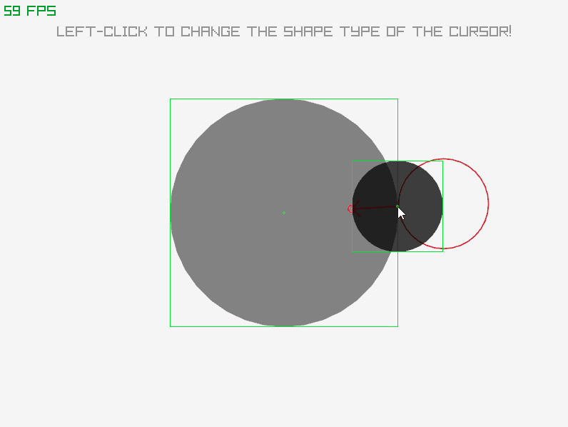
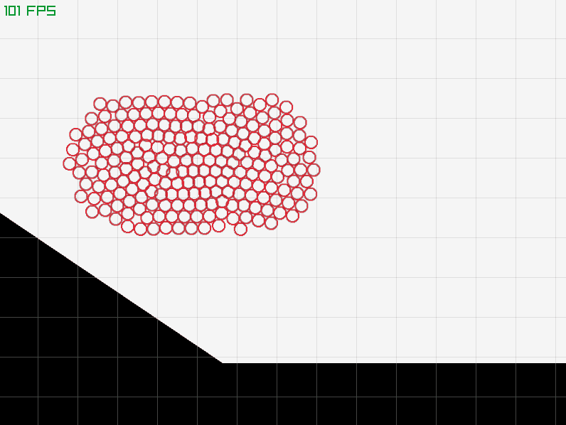
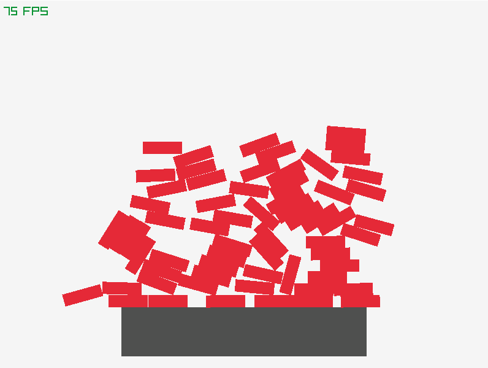
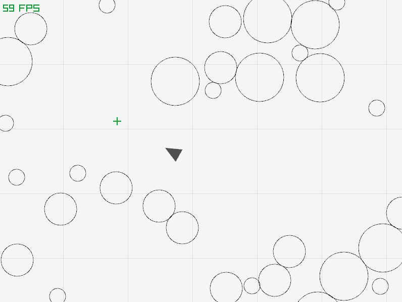
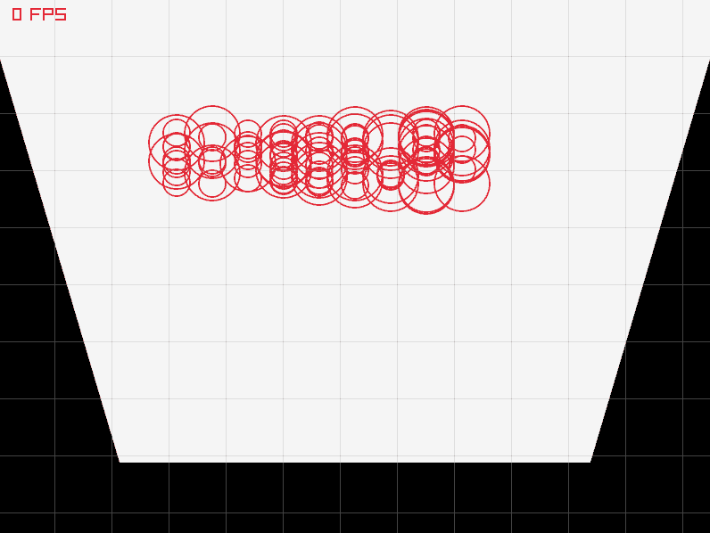
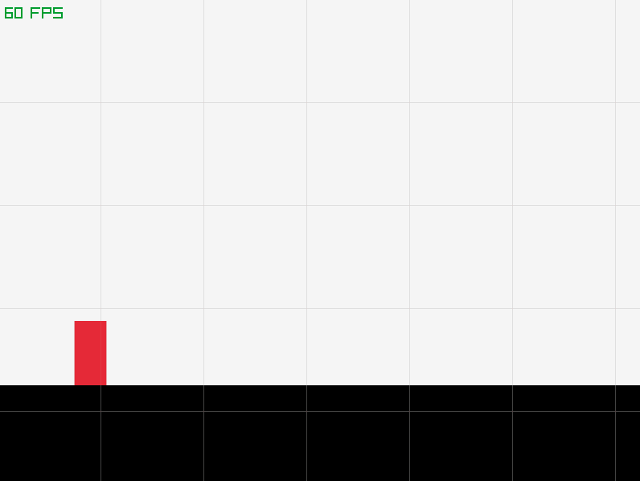
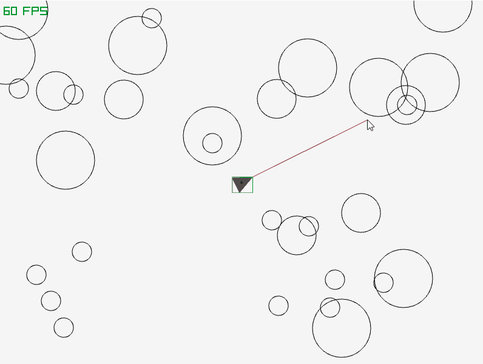

<div align="center">

<br>

[](https://github.com/c-krit/ferox/releases)
[](https://www.codefactor.io/repository/github/c-krit/ferox)
[](https://github.com/c-krit/ferox)
[](https://github.com/c-krit/ferox/blob/main/LICENSE)

A 2D collision detection and physics library written in C.

**WARNING: This library is in an early alpha stage, use it at your own risk.**

[Documentation](https://github.com/c-krit/ferox/wiki) &mdash;
**Examples** &mdash;
[Prerequisites](#prerequisites)

</div>

## Examples

This directory contains the example source files for `ferox`.

To build all examples, run the following commands (replace `make` with `make PLATFORM=WINDOWS` to build for Windows):

```console
$ cd examples
$ make
```

---

### `arrow.c`

<details>
  <summary>Show Example</summary>

  
</details>

### `bouncy.c`

<details>
  <summary>Show Example</summary>

  
</details>

### `bricks.c`

<details>
  <summary>Show Example</summary>

  
</details>

### `bullet.c`

<details>
  <summary>Show Example</summary>

  
</details>

### `circles.c`

<details>
  <summary>Show Example</summary>

  
</details>

### `jump.c`

<details>
  <summary>Show Example</summary>

  
</details>

### `laser.c`

<details>
  <summary>Show Example</summary>

  
</details>

### `smash.c`

<details>
  <summary>Show Example</summary>

  
</details>

## License

MIT License
